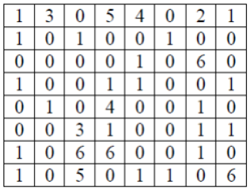

# Exercício - Tabuleiro de xadrez

Vamos supor que várias pedras do jogo de xadrez estão no tabuleiro. Para facilitar a indicação das peças, vamos convencionar:

0. ausência de peças 
1. peões  

1. cavalos 
2. torres 
3. bispos 
4. reis 
5. rainhas  

O tabuleiro é o seguinte:

Construa um programa, em linguagem C, que:

a)	Solicite ao usuário que informe qual peça deseja colocar em cada posição do tabuleiro.

b)	Mostre o tabuleiro informado pelo usuário na tela.

c)	Determine qual a quantidade de cada tipo de peça no tabuleiro.  

